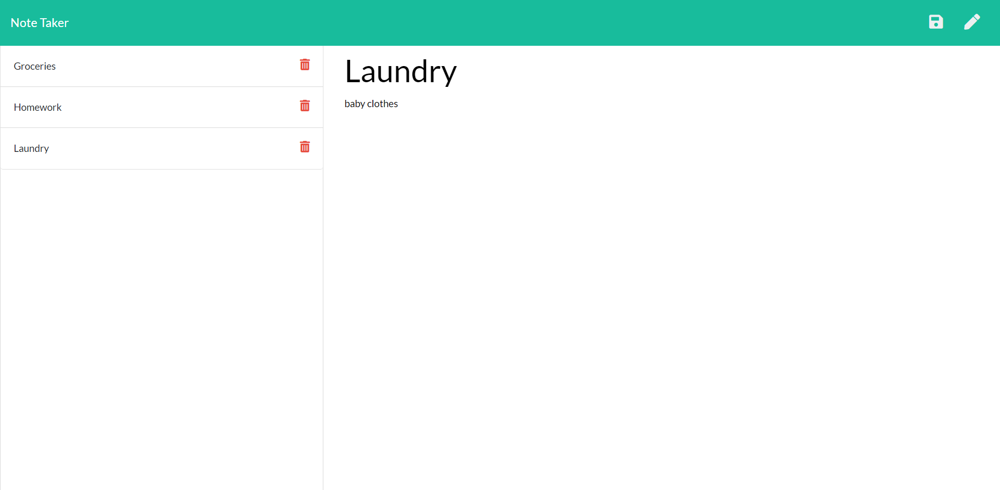

# 11-EXPRESS.JS-NOTE-TAKER

# Description
Help organize your life with Note Taker, an application used to write, save and delete notes as you go.  This application uses an Express.js back end and will save and retrieve note data from a JSON file.

# Table of Contents
1. [Title](Title)
2. [Description](#description)
3. [Installation](#installation)
4. [Contributing](#contribution)
5. [Questions](#questions)
6. [License](#demo)
7. [Heroku](#heroku)
8.  [Screenshot](#screenshot)
# Installation 
I used 'npm i' to insall all required pacakages.
# Contribution
Myself
# Questions
## GitHub 
 Lyndseyfin
## Email 
 lyndseyfinamore@gmail.com
## License

## Heroku
## Screenshot

